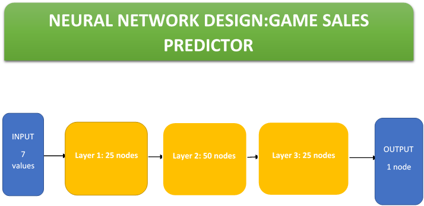

TensorFlow is a software framework for building and deploying machine learning models. Here I train with two dataset of different games sold in a store. The data are classified based on certain criteria. The neural network is then trained with these training and test data. After all is done, the trained network is able to predict the sales of a new game coming to the market. Train-test-evaluation flow in TensorFlow steps were used in this implementation.

Here in pycharm I created a project containing a python file and my training and test data.

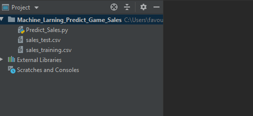

**Here are the layers and number of nodes:**

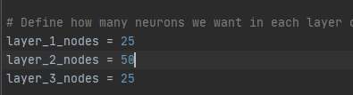

**Training data: run layer 1 with 25 nodes**

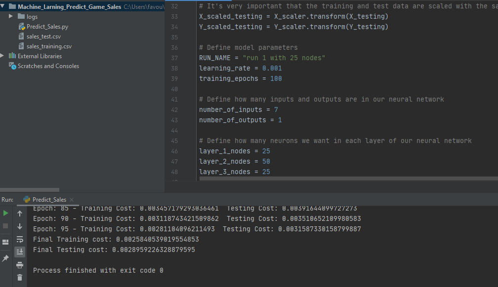

**Training Run layer 1 with 10 nodes:**

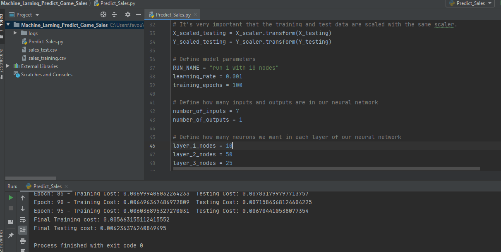

**Run layer 1 with 5 nodes:**

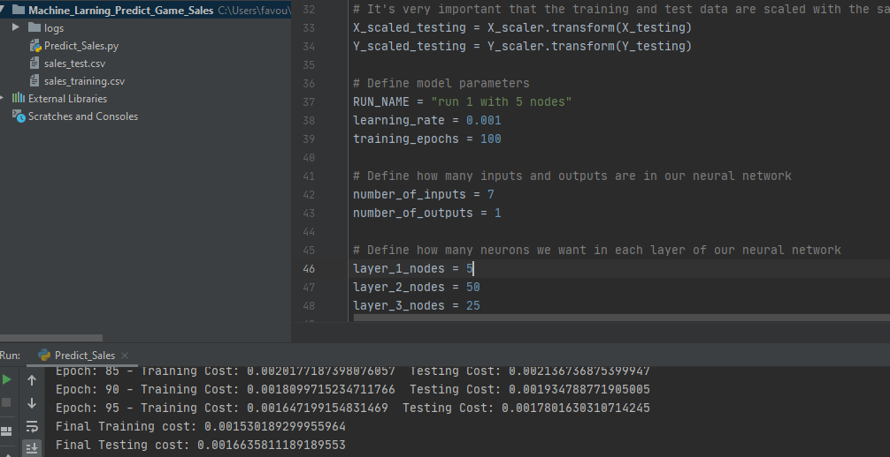

**Running tensorboard. Generating ip to run on tensorboard in terminal**

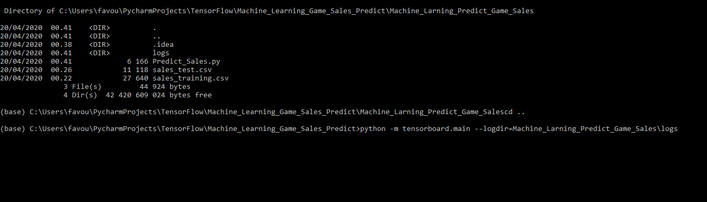

Ip generated for tensorboard

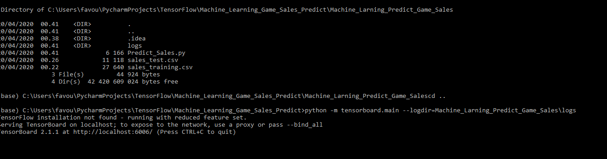

**Tensorboard page:**

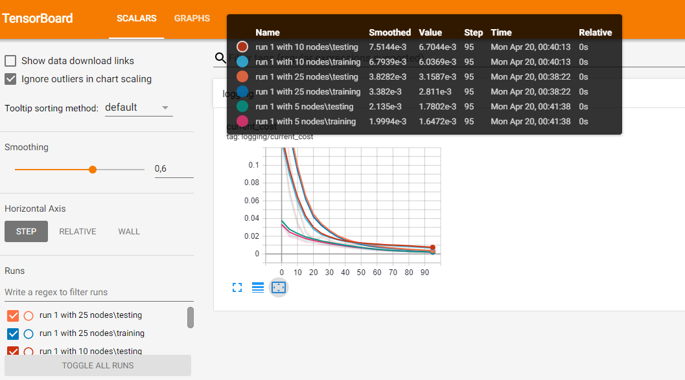

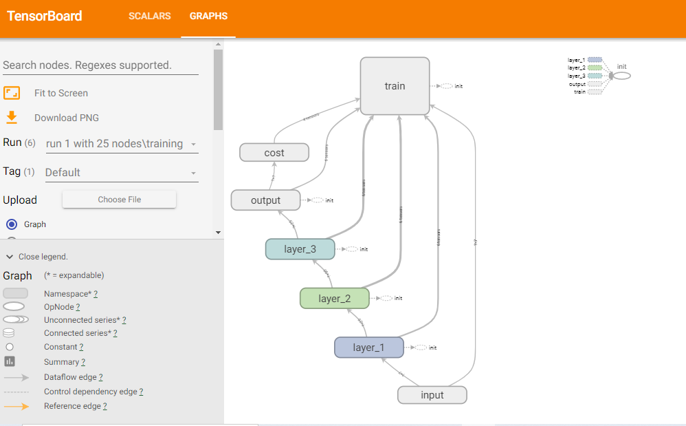

**Tracing input to output:**

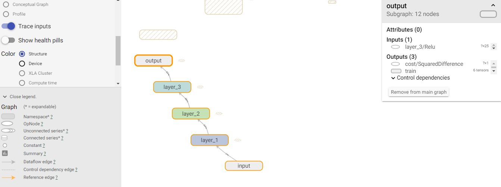

INSTALLING TENSORFLOW AND PYTHON(WINDOWS)

1.Install preparked python 3 on anaconda website. accept all default options

2. Install pycharm and configure the interpreter by selecting and installing python 3within pycharm setting and create a projects

3. Install tensorflow manually by installing it on the command line. launch the anacoda prompt application on window

- activate python 3 environment by typing
- activate tensorflow

4. then install tensorflow from tensorflow website: do the following in terminal

- conda create -n [environment-name] e.g tensorenviron
- activate tensorenviron
- conda install tensorflow

TO CALL OR RUN TENSORBOARD:

1. open terminal from anaconda navigator: and navigate to the project directory then type

- tensorboard --logdir={log folder path}

OR

- python -m tensorboard.main --logdir={log folder path}